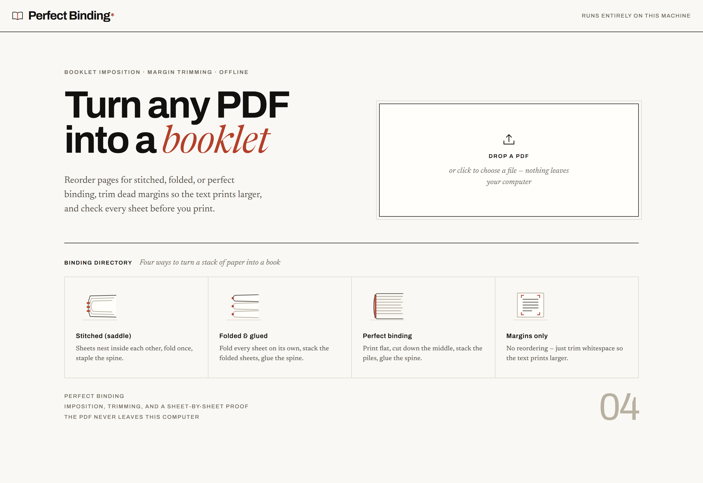
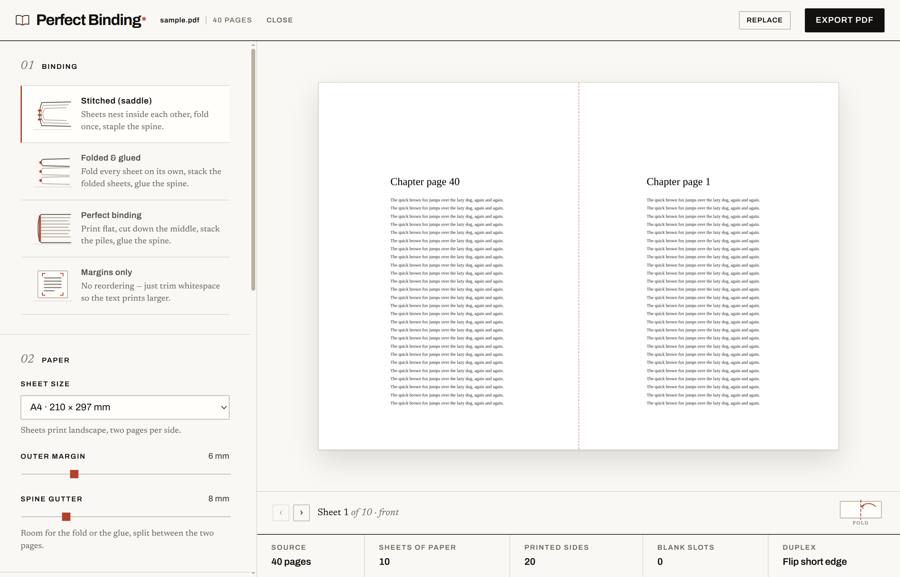
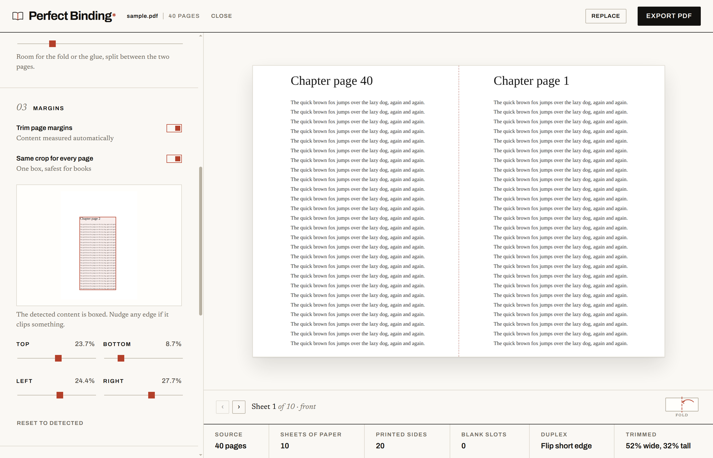

# Perfect Binding

Desktop app that turns a PDF into a print-ready booklet. Reorders pages for
**stitched (saddle) binding**, **folded & glued**, or **perfect binding**, trims
dead margins so the text prints larger, and previews every sheet before you
export.

Everything runs locally — the PDF never leaves the machine.



## Features

- **Four ways to bind.** Stitched (saddle), folded & glued, perfect binding, or
  margins-only with no reordering at all. Each one is explained in the app, in
  the [section below](#what-the-four-modes-do), and drawn on the card you pick.
- **Automatic margin trimming.** Every page is scanned for its content box, the
  results are merged across the document, and the crop is scaled back up to fill
  the sheet. Nudge any edge by hand if the detector clips something.
- **A sheet-by-sheet proof.** Step through every sheet, front and back, with the
  fold line or the cut line drawn where it will fall — before you spend paper.
- **The numbers that decide the print job.** Sheets of paper, printed sides,
  blank slots, duplex flip, and how much was trimmed, kept in view at all times.
- **Paper and spine controls.** A4, Letter, Legal, A3, Tabloid, or A5; outer
  margin and spine gutter in millimetres; signature size for thick
  saddle-stitched books that would otherwise fold badly at the fore-edge.
- **Offline by construction.** No network calls, no telemetry, no upload step.
  The Electron shell runs under `default-src 'self'`.



Margin trimming on, with the detected content box and the four edge nudges:



## Install

Prebuilt installers are attached to every release —
**[latest release →](https://github.com/jose-garzon/perfect-binding/releases/latest)**

**Linux** — download the AppImage, make it executable, run it:

```bash
chmod +x PerfectBinding-*-linux-x86_64.AppImage
./PerfectBinding-*-linux-x86_64.AppImage
```

Or install the `.deb`: `sudo apt install ./PerfectBinding-*-linux-amd64.deb`

**Windows** — run `PerfectBinding-<version>-win-x64.exe`. The build is unsigned,
so SmartScreen warns on first launch: *More info → Run anyway*.

**macOS** — open the `.dmg` (`-arm64` for Apple silicon, `-x64` for Intel) and
drag the app to Applications. Also unsigned, so the first launch needs
right-click → *Open* rather than a double-click.

## Build it from source

```bash
bun install
bun run dev        # dev server + Electron window, hot reloading
bun run package    # installers for this platform into release/
```

| Script | What it does |
| --- | --- |
| `bun run dev` | Electron app against the hot-reloading dev server |
| `bun run web` | Dev server only, open http://localhost:3123 in a browser |
| `bun run build` | Bundles the renderer into `dist/` |
| `bun run start` | Builds, then runs the packaged renderer in Electron |
| `bun run package` | Builds an installer into `release/` (electron-builder) |
| `bun test` | Unit tests for the imposition, crop, and PDF-building logic |
| `bun run smoke` | Launches the packaged app, drops a 3 MB generated PDF on it, asserts a sheet renders and the CSP holds |
| `bun run smoke:dev` | Same checks against a running `bun run web` dev server (React development build) |
| `bun run shots` | Re-captures the screenshots in this README |
| `bun run icon` | Re-renders the app icon PNGs from `assets/icon.svg` |
| `bun run typecheck` | `tsc --noEmit` |

## What the four modes do

**Stitched (saddle).** Sheets nest inside one another and are stapled through
the fold, so the outermost sheet carries the first and last pages. Page count is
padded to a multiple of 4. Thick books fold badly at the fore-edge, so the
signature slider splits the job into nested groups of N sheets that you bind
together afterwards.

**Folded & glued.** Every sheet is folded on its own — no nesting — and the
folded sheets are stacked and glued at the spine. This is a saddle imposition
with exactly one sheet per signature, so sheet 1 carries pages 4 and 1 on the
front and 2 and 3 on the back. The spine stays square no matter how long the
document is, and nothing needs stapling.

**Perfect binding.** Sheets stay flat and are printed as a *cut stack*: sheet 1
carries pages 1 and 1+N/2, sheet 2 carries pages 2 and 2+N/2, and so on. Slice
every sheet down the middle, drop the right-hand pile under the left-hand pile,
and the book is in order, ready to glue.

**Margins only.** No reordering. The detected content box is cropped and scaled
up to fill the paper — useful for academic PDFs with enormous margins.

## Margin detection

Each page is rendered small with pdf.js and scanned for non-white pixels. Rows
and columns with less ink than the noise floor are ignored, which kills scanner
speckle and edge shadows. Per-page results are merged with a low percentile so a
single full-bleed page doesn't cancel the crop for the whole document. Every
edge stays adjustable by hand in the sidebar.

## Printing

Print double-sided, landscape, **at 100% scale** (no "fit to page" — it defeats
the margin work). If the backs of your sheets come out upside down, flip the
*Duplex flip* setting between short edge and long edge; that rotates the back
sides 180° in the exported file.

## Three things worth knowing before changing the renderer

**PDF bytes never travel through React state or props.** React's development
build diffs changed props onto its performance track via `performance.measure`,
and a multi-megabyte `Uint8Array` there throws `DataCloneError: … out of memory`
and then corrupts the commit phase (`Should not already be working`). Bytes live
in refs; the preview receives a `blob:` URL and pdf.js objects are reached
through callbacks. `bun run smoke:dev` fails if this regresses.

**Fonts are bundled, and their @font-face rules live in `index.html`.** The
Electron CSP is `default-src 'self'` with no `font-src`, so nothing may be
fetched from a CDN — and a `data:` font is blocked just as firmly, which matters
because Bun's CSS bundler silently inlines any small asset it can resolve from a
stylesheet. Declaring the faces in an inline `<style>` in `index.html` keeps them
out of the bundler's reach: the paths pass through untouched, `build.ts` copies
the files into `dist/fonts/`, and `server.ts` serves them in dev. Any future
typeface has to follow the same route.

**Canvas renders are cancelled, not stacked.** pdf.js refuses to paint a canvas
that is already being painted, which React Strict Mode triggers constantly.
`renderPage` cancels any in-flight task for that canvas first.

## Layout

```
src/core/         pure logic, no DOM — unit tested
  imposition.ts   page order → sheet sides (signature size 1 = folded & glued)
  crop.ts         whitespace detection over raw pixels
  build.ts        pdf-lib output assembly
  paper.ts        paper sizes in points
src/renderer/     React UI (no framework beyond React + hand-written CSS)
  lib/pdf.ts      pdf.js loading, page rendering, margin scanning
  fonts/          Archivo and Newsreader, Latin subsets, SIL OFL (see OFL.txt)
electron/         main, preload, and the CSP applied as a response header
scripts/          dev launcher, icon rasteriser, screenshots, smoke test
assets/           icon.svg (the source), its PNGs, and the README screenshots
```

The app icon is drawn once in `assets/icon.svg` — a magazine standing cover-out,
spine toward the viewer, in the same paper/ink/terracotta palette as the UI.
Edit that file and run `bun run icon` to re-render every PNG size.

## Releasing

`.github/workflows/ci.yml` runs typecheck, tests, and the renderer build on
every push and PR. `.github/workflows/release.yml` cuts the binaries:

```bash
# bump "version" in package.json first
git tag v0.2.0
git push origin v0.2.0
```

The tag fans out to Linux, Windows, and macOS runners, each running
`bun run build` + `electron-builder`, and the installers are uploaded to a
GitHub release for that tag. Re-running the workflow re-uploads over the same
release. It can also be started by hand from the Actions tab with a tag name
(`workflow_dispatch`); the tag must already exist.

## Licence

MIT — see [LICENSE](LICENSE). The bundled typefaces are under the SIL Open Font
Licence; see `src/renderer/fonts/OFL.txt`.
